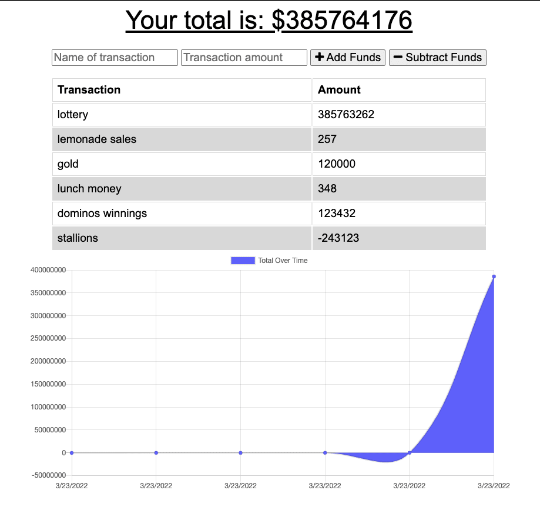

# Common Cents

## Description:

This application allows users to track the debits and credits of their financial life. Refactored as a PWA, users can record transactions while offline. The data will be uploaded upon connection.

## Table of Contents

* [Installation](#installation)
* [Usage](#usage)
* [Screenshot](#screenshot)

## Installation
To install this application on your local device, clone the repository. In your terminal, navigate to the root directory and run the command ```npm install``` to install all required dependencies.

## Usage
On your local machine with all dependencies installed, navigate to the root directory of the application in your terminal. Run the command ```npm run start```. The application can also be accessed at https://serene-temple-91024.herokuapp.com/.

## Screenshot

